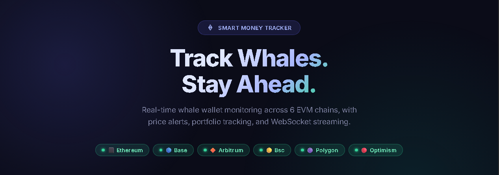
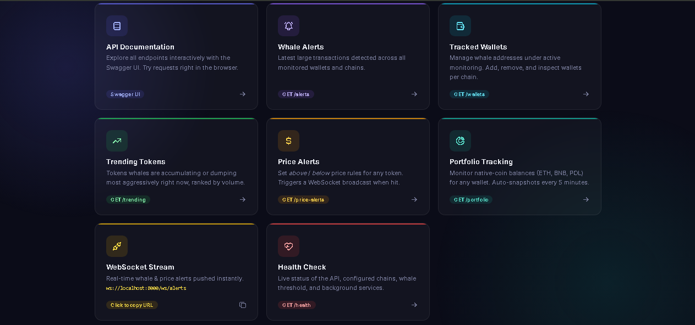

<div align="center">



# 🐋 Smart Money Tracker

[](https://github.com/ArgosSystems/Smart-Money-Tracker/releases)
[](https://www.python.org/downloads/)
[](https://fastapi.tiangolo.com/)
[](https://opensource.org/licenses/MIT)
[](https://discordpy.readthedocs.io/)
[](https://github.com/ArgosSystems/Smart-Money-Tracker)

**Track whale wallets across multiple chains in real-time and get instant alerts on Discord or Telegram.**

Smart Money Tracker monitors wallets on **Ethereum, Base, Arbitrum, BSC, Polygon, and Optimism** for large transactions, calculates USD values, and delivers beautiful alerts to your favorite messaging platform. Perfect for traders, researchers, and crypto enthusiasts who want to follow the "smart money."

**Founded by [@ArgosSystems](https://github.com/ArgosSystems)**  
Architected with Claude Code • Multi-chain vision • Smart Money labels

**Accelerated by [@aymenelouadi](https://github.com/aymenelouadi)**  
Backend scaling • 5 chains • WebSocket • Dashboard


[📖 Docs](#-api-documentation) · [🚀 Quick Start](#-quick-start) · [🤖 Bot Commands](#-bot-commands) · [⚙️ Configuration](#️-configuration) · [🤝 Contributing](#-contributing)

<a href="https://github.com/ArgosSystems/Smart-Money-Tracker" target="_blank">
  
</a>

</div>

---

## ✨ Features



| | Feature | Description |
|---|---|---|
| 🔗 | **Multi-Chain Support** | Monitor wallets on **Ethereum**, **Base**, **Arbitrum**, **BSC**, **Polygon**, and **Optimism** simultaneously |
| 🐋 | **Whale Tracking** | Detect large ERC-20 token and native-coin transfers above your USD threshold |
| 💰 | **Price Alerts** | Set `above` / `below` price rules per token; triggers broadcast in real-time via WebSocket |
| 📁 | **Portfolio Tracking** | Monitor native-coin balances for any wallet across chains; automatic snapshots every 5 min |
| ⚡ | **WebSocket Stream** | Real-time push of whale alerts via `/ws/alerts` (supports `wss://` for HTTPS deployments) |
| 📊 | **Trending Tokens** | See which tokens whales are accumulating or dumping across all chains |
| 🤖 | **Multi-Platform Bots** | Discord (18 slash commands, Components V2) and Telegram bots |
| 🔌 | **REST API** | Full-featured API with Swagger UI and ReDoc documentation |
| 💾 | **SQLite Database** | Zero-config persistent storage with automatic migrations |
| 🎨 | **Visual Dashboard** | Dark-theme web UI served at the root URL |
| 🌐 | **External Deployment** | Set `API_BASE_URL` once to point bots at any VPS, Pterodactyl node, or domain |
| 🔐 | **Discord OAuth2** | `/invite` command generates a scoped bot-invite link automatically |

---

## 🏗️ Architecture

```
┌─────────────────────────────────────────────────────────────────────────────┐
│                              User Interface                                 │
├──────────────────────────────┬───────────────────────┬──────────────────────┤
│         Discord Bot          │    Web Dashboard       │    Telegram Bot      │
│      (discord.py 2.7.1)      │    configurable URL    │   (ptb 21.0)         │
│  • 18 slash commands (CV2)   │  • Dark-theme UI       │  • Multi-chain       │
│  • OAuth2 /invite command    │  • Swagger + ReDoc     │  • Command parity    │
└──────────────────┬───────────┴───────────────────────┴──────────┬───────────┘
                   │              HTTP REST API                    │
                   └──────────────────────┬────────────────────────┘
                                          │
┌─────────────────────────────────────────▼───────────────────────────────────┐
│                         FastAPI Backend  (Port 8000)                        │
│   Wallet Management · Alert History · Price Alerts · Portfolio Tracking    │
│   WebSocket Broadcaster · Token Activity / Trending                        │
└─────────┬──────────────────────┬──────────────────────┬─────────────────────┘
          │                      │                       │
┌─────────▼────────┐  ┌──────────▼──────────┐  ┌────────▼───────────┐
│ MultiChainTracker│  │  SQLite  (async)     │  │  CoinGecko API     │
│ • ChainScanner   │  │  TrackedWallet       │  │  (60s TTL cache)   │
│   per chain      │  │  WhaleAlert          │  └────────────────────┘
│ • Concurrent     │  │  TokenActivity       │
│   polling        │  │  PriceAlertRule      │
└─────────┬────────┘  │  PortfolioWallet     │
          │           │  PortfolioSnapshot   │
  ⬛ ETH  🔵 Base     └─────────────────────-┘
  🔶 ARB  🟡 BSC  🟣 MATIC  🔴 OP
```

---

## 🚀 Quick Start

### Prerequisites

- Python 3.11 or higher
- An [Alchemy](https://www.alchemy.com/) account (free tier works)
- A Discord bot token (optional) — [Create one here](https://discord.com/developers/applications)
- A Telegram bot token (optional) — [Talk to BotFather](https://t.me/botfather)

### Installation

1. **Clone the repository**
   ```bash
   git clone https://github.com/ArgosSystems/Smart-Money-Tracker.git
   cd Smart-Money-Tracker
   ```

2. **Create a virtual environment**
   ```bash
   python -m venv .venv
   # Windows:
   .venv\Scripts\activate
   # Linux / macOS:
   source .venv/bin/activate
   ```

3. **Install dependencies**
   ```bash
   pip install -r requirements.txt
   ```

4. **Configure environment variables**

   Copy the provided template and fill in your values:
   ```bash
   cp .env.example .env
   ```

   Minimum `.env` for local use:
   ```env
   # Alchemy API key — auto-derives RPC URLs for all chains
   ALCHEMY_API_KEY=your_alchemy_api_key_here

   # Choose one or both bots
   DISCORD_TOKEN=your_discord_bot_token_here
   TELEGRAM_TOKEN=your_telegram_bot_token_here
   ```

   **Deploying on a VPS / Pterodactyl / behind a domain?** Add:
   ```env
   # Public URL the bots will use to reach the API
   API_BASE_URL=http://your-server.host:8000
   # or: API_BASE_URL=https://tracker.yourdomain.com

   # Discord OAuth2 — enables the /invite slash command
   DISCORD_CLIENT_ID=123456789012345678
   DISCORD_CLIENT_SECRET=your_client_secret_here
   ```

   See [`.env.example`](.env.example) for the full list of variables.

5. **Run the application**

   **Windows — PowerShell:**
   ```powershell
   .\run.ps1              # API + Discord bot
   .\run.ps1 --telegram   # API + Telegram bot
   .\run.ps1 --api-only   # API only
   ```

   **Linux / macOS:**
   ```bash
   chmod +x run.sh
   ./run.sh              # API + Discord bot
   ./run.sh --telegram   # API + Telegram bot
   ./run.sh --api-only   # API only
   ```

   **Any platform (direct Python):**
   ```bash
   python start.py              # API + Discord bot
   python start.py --telegram   # API + Telegram bot
   python start.py --api-only   # API only
   ```

   **Docker (any platform — no Python install needed):**
   ```bash
   cp .env.example .env   # fill in your keys
   docker compose up -d
   docker compose logs -f
   ```

6. **Open the dashboard** → [http://localhost:8000](http://localhost:8000)

7. **Invite your Discord bot** (if using Discord)

   **Easiest way:** set `DISCORD_CLIENT_ID` in `.env`, then run `/invite` inside any server the bot has joined — it will post a ready-made OAuth2 link with the correct scopes and permissions.

   **Manual invite:** go to your [Discord Developer Portal](https://discord.com/developers/applications), navigate to **OAuth2 → URL Generator**, select `bot` and `applications.commands` scopes, and use the generated link.

---

## 📚 API Documentation

Once the API is running, access the interactive documentation at:

| UI | URL |
|---|---|
| **Web Dashboard** | `http://{host}:{port}/` |
| **Swagger UI** | `http://{host}:{port}/docs` |
| **ReDoc** | `http://{host}:{port}/redoc` |
| **Health Check** | `http://{host}:{port}/health` |

> Replace `{host}:{port}` with `localhost:8000` locally, or whatever you set in `API_BASE_URL` for remote deployments.

### Full Endpoint Reference

| Method | Endpoint | Description |
|--------|----------|-------------|
| `GET` | `/health` | API health check with per-chain status |
| **Whale Tracking** | | |
| `POST` | `/api/v1/wallets/track` | Add wallet to tracking |
| `DELETE` | `/api/v1/wallets/{address}` | Stop tracking a wallet |
| `GET` | `/api/v1/wallets` | List all tracked wallets (filter: `?chain=`) |
| `GET` | `/api/v1/alerts` | Recent whale alerts (filter: `?chain=`, paginated) |
| `GET` | `/api/v1/alerts/token/{token}` | Alerts for a specific token |
| `GET` | `/api/v1/tokens/trending` | Top tokens by whale activity |
| `WS` | `/ws/alerts` | **WebSocket** real-time alert stream (`?chain=` filter) |
| **Price Alerts** | | |
| `POST` | `/api/v1/price-alerts` | Create a price alert rule |
| `GET` | `/api/v1/price-alerts` | List rules (`?active_only=true`) |
| `GET` | `/api/v1/price-alerts/{id}` | Retrieve a single rule |
| `DELETE` | `/api/v1/price-alerts/{id}` | Delete a rule (HTTP 204) |
| `PATCH` | `/api/v1/price-alerts/{id}/toggle` | Enable / disable a rule |
| **Portfolio Tracking** | | |
| `POST` | `/api/v1/portfolio/wallets` | Add wallet to portfolio |
| `GET` | `/api/v1/portfolio/wallets` | List portfolio wallets |
| `GET` | `/api/v1/portfolio/wallets/{id}` | Get single wallet |
| `DELETE` | `/api/v1/portfolio/wallets/{id}` | Remove wallet + snapshots (HTTP 204) |
| `PATCH` | `/api/v1/portfolio/wallets/{id}/toggle` | Pause / resume snapshots |
| `GET` | `/api/v1/portfolio/wallets/{id}/balance` | Live on-chain balance (saves snapshot) |
| `GET` | `/api/v1/portfolio/wallets/{id}/snapshots` | Balance history (newest-first) |

---

### WebSocket — Real-time Alerts

```javascript
// All chains (replace host:port with your deployment URL)
const ws = new WebSocket('ws://localhost:8000/ws/alerts');

// Single chain filter
const ws = new WebSocket('ws://localhost:8000/ws/alerts?chain=ethereum');

// HTTPS deployments automatically upgrade to wss://
// const ws = new WebSocket('wss://tracker.yourdomain.com/ws/alerts');

ws.onmessage = (event) => {
    const alert = JSON.parse(event.data);
    console.log(`${alert.chain} | ${alert.direction} ${alert.token_symbol} — $${alert.amount_usd.toFixed(0)}`);
};
```

Quick test with `wscat`:
```bash
npx wscat -c "ws://localhost:8000/ws/alerts"
```

Price alerts also arrive via the same stream with `"type": "price_alert"`.

---

### Price Alerts

```bash
# Alert when PEPE on Ethereum goes above $0.00002
curl -X POST http://localhost:8000/api/v1/price-alerts \
  -H "Content-Type: application/json" \
  -d '{"chain":"ethereum","token_address":"0x6982508145454ce325ddbe47a25d4ec3d2311933","token_symbol":"PEPE","condition":"above","target_price_usd":0.00002,"label":"PEPE moon alert"}'

# List active rules
curl "http://localhost:8000/api/v1/price-alerts?active_only=true"

# Toggle / delete
curl -X PATCH http://localhost:8000/api/v1/price-alerts/1/toggle
curl -X DELETE http://localhost:8000/api/v1/price-alerts/1
```

---

### Portfolio Tracking

```bash
# Add vitalik.eth to portfolio
curl -X POST http://localhost:8000/api/v1/portfolio/wallets \
  -H "Content-Type: application/json" \
  -d '{"address":"0xd8dA6BF26964aF9D7eEd9e03E53415D37aA96045","chain":"ethereum","label":"vitalik.eth"}'

# Fetch live on-chain balance (also saves a snapshot)
curl http://localhost:8000/api/v1/portfolio/wallets/1/balance

# View balance history
curl "http://localhost:8000/api/v1/portfolio/wallets/1/snapshots?limit=20"
```

Example balance response:
```json
{
  "wallet_id": 1,
  "address": "0xd8da6bf26964af9d7eed9e03e53415d37aa96045",
  "chain": "ethereum",
  "native_symbol": "ETH",
  "native_balance": 246.37,
  "native_price_usd": 3521.40,
  "total_usd": 867433.18,
  "fetched_at": "2026-03-12T10:00:00"
}
```

---

## 🤖 Bot Commands

### Discord Slash Commands

All responses use **Discord Components V2** (discord.py 2.7.1).

**🐋 Whale Tracking**

| Command | Description |
|---------|-------------|
| `/track_wallet <address> [chain] [label]` | Start tracking a whale wallet |
| `/untrack_wallet <address> [chain]` | Stop tracking a wallet |
| `/whale_alerts [chain] [count]` | Show recent whale transactions |
| `/smart_money <token> [chain]` | Buy/sell sentiment for a specific token |
| `/trending [chain]` | Top tokens whales are accumulating |

**📁 Portfolio**

| Command | Description |
|---------|-------------|
| `/portfolio_add <address> [chain] [label]` | Add wallet to balance tracking |
| `/portfolio_list [chain]` | List all tracked wallets |
| `/portfolio_balance <id>` | Fetch live on-chain balance (saves snapshot) |
| `/portfolio_remove <id>` | Delete wallet and all snapshots |
| `/portfolio_toggle <id>` | Pause / resume automatic snapshots |

**🔔 Price Alerts**

| Command | Description |
|---------|-------------|
| `/price_alert_add <symbol> <address> <chain> <condition> <price> [label]` | Create a price alert |
| `/price_alerts [chain] [active_only]` | List all alert rules |
| `/price_alert_delete <id>` | Delete an alert rule |
| `/price_alert_toggle <id>` | Enable / disable a rule |

**ℹ️ Info**

| Command | Description |
|---------|-------------|
| `/chains` | List all supported chains with live status |
| `/status` | API health and per-chain configuration |
| `/invite` | Generate the OAuth2 bot-invite link |
| `/help [command]` | Overview of all commands, or detailed usage for one |

### Telegram Commands

| Command | Description |
|---------|-------------|
| `/track <address> [chain] [label]` | Start tracking a wallet |
| `/untrack <address> [chain]` | Stop tracking a wallet |
| `/alerts [count] [chain]` | Show recent whale transactions |
| `/smartmoney <token>` | Whale activity for a specific token |
| `/trending [chain]` | Top tokens whales are buying |
| `/chains` | List all supported chains |
| `/status` | Check API health |

### Chain Reference

| Chain | Emoji | Chain ID | Block Time | Poll Interval |
|-------|-------|----------|------------|---------------|
| Ethereum | ⬛ | 1 | ~12s | 12s |
| Base | 🔵 | 8453 | ~2s | 10s |
| Arbitrum | 🔶 | 42161 | ~0.25s | 5s |
| BSC | 🟡 | 56 | ~3s | 6s |
| Polygon | 🟣 | 137 | ~2s | 6s |
| Optimism | 🔴 | 10 | ~2s | 6s |

---

## ⚙️ Configuration

### Required

| Variable | Description |
|----------|-------------|
| `ALCHEMY_API_KEY` | Single Alchemy API key — auto-derives RPC URLs for ETH, Base, Arbitrum, Polygon, and Optimism |

### Optional — Chain-Specific RPC Overrides

| Variable | Description |
|----------|-------------|
| `ALCHEMY_ETH` | Override Ethereum RPC URL |
| `ALCHEMY_BASE` | Override Base RPC URL (default: `https://mainnet.base.org`) |
| `ALCHEMY_ARB` | Override Arbitrum RPC URL |
| `ALCHEMY_POLYGON` | Override Polygon RPC URL |
| `ALCHEMY_OPT` | Override Optimism RPC URL |
| `BSC_RPC` | BSC RPC URL (default: `https://bsc-dataseed.binance.org/`) |

### Optional — Bot Tokens

| Variable | Description |
|----------|-------------|
| `DISCORD_TOKEN` | Discord bot token |
| `TELEGRAM_TOKEN` | Telegram bot token |

### Optional — External Deployment

| Variable | Default | Description |
|----------|---------|-------------|
| `API_BASE_URL` | *(localhost)* | Public URL the bots use to reach the API — e.g. `http://1.2.3.4:8000` or `https://tracker.example.com` |

### Optional — Discord OAuth2

| Variable | Default | Description |
|----------|---------|-------------|
| `DISCORD_CLIENT_ID` | `""` | Application Client ID — enables the `/invite` command |
| `DISCORD_CLIENT_SECRET` | `""` | Client secret (required for OAuth code-exchange flows) |
| `DISCORD_OAUTH_SCOPES` | `bot applications.commands` | Space-separated OAuth2 scopes added to the invite URL |
| `DISCORD_OAUTH_PERMISSIONS` | `2147568640` | Integer permission bits on the invite URL |

### Optional — General Settings

| Variable | Default | Description |
|----------|---------|-------------|
| `WHALE_THRESHOLD_USD` | `10000` | Minimum USD value to trigger a whale alert |
| `API_HOST` | `0.0.0.0` | API server bind address |
| `API_PORT` | `8000` | API server port |
| `DATABASE_URL` | `sqlite+aiosqlite:///./crypto_bots.db` | Database connection string |

---

## 📁 Project Structure

```
Smart-Money-Tracker/
├── start.py                      # Unified launcher (auto-activates venv, cross-platform)
├── run.ps1                       # Windows PowerShell launcher (auto-kills port 8000)
├── run.sh                        # Linux / macOS launcher (auto-kills port 8000)
├── run.bat                       # Windows CMD launcher
├── requirements.txt
├── docker-compose.yml
├── Dockerfile
│
├── api/
│   ├── main.py                   # App entry, lifespan, background tasks, dashboard
│   ├── models.py                 # SQLAlchemy ORM models + DB setup
│   └── routers/
│   │   ├── alerts.py             # Whale alerts + WebSocket endpoint
│   │   ├── whales.py             # Wallet management
│   │   ├── price_alerts.py       # Price alert rules CRUD
│   │   └── portfolio.py          # Portfolio wallet + snapshot endpoints
│   └── services/
│       ├── broadcaster.py        # WebSocket pub/sub singleton
│       ├── whale_tracker.py      # Multi-chain scanning engine
│       ├── price_alerts.py       # Price alert checker (60s loop)
│       └── portfolio_tracker.py  # Portfolio snapshot service (5 min loop)
│
├── bots/
│   ├── discord_bot/
│   │   ├── bot.py                # Discord bot setup + slash command sync
│   │   ├── commands.py           # Entry point — calls all setup_*() functions
│   │   ├── _shared.py            # Constants, HTTP helpers, CV2 builders
│   │   ├── cmd_whale.py          # /track_wallet /untrack_wallet /whale_alerts /smart_money /trending
│   │   ├── cmd_portfolio.py      # /portfolio_add /list /balance /remove /toggle
│   │   ├── cmd_price_alerts.py   # /price_alert_add /price_alerts /delete /toggle
│   │   ├── cmd_info.py           # /chains /status /invite
│   │   └── cmd_help.py           # /help [command]
│   └── telegram_bot/
│       ├── bot.py
│       └── handlers.py
│
├── config/
│   ├── chains.py                 # Chain registry (6 chains)
│   └── settings.py               # Pydantic settings + RPC URL resolver
│
└── docs/
    ├── dash.png
    ├── card.png
    └── architecture.md
```

---

## 🔧 Development

```bash
# API with auto-reload
uvicorn api.main:app --reload --host 0.0.0.0 --port 8000

# Run tests
pip install pytest pytest-asyncio httpx
pytest tests/ -v
```

---

## 🤝 Contributing

Contributions are welcome!

1. Fork the repository at [github.com/ArgosSystems/Smart-Money-Tracker](https://github.com/ArgosSystems/Smart-Money-Tracker)
2. Create your feature branch: `git checkout -b feature/AmazingFeature`
3. Commit your changes: `git commit -m 'Add some AmazingFeature'`
4. Push to the branch: `git push origin feature/AmazingFeature`
5. Open a Pull Request

Please read [CONTRIBUTING.md](CONTRIBUTING.md) for our code of conduct.

---

## 🛡️ Security

- **Never commit your `.env` file** — it contains sensitive API keys
- **Use environment variables** in production deployments
- **Limit bot permissions** — only grant the minimum required permissions

See [SECURITY.md](SECURITY.md) for our vulnerability disclosure policy.

---

## 📊 Roadmap

- [x] Multi-chain support — Ethereum, Base, Arbitrum, BSC, Polygon, Optimism
- [x] WebSocket real-time alert stream
- [x] Price alerts with above/below rules
- [x] Portfolio tracking with balance snapshots
- [x] Visual web dashboard + dark Swagger UI / ReDoc
- [x] Docker deployment
- [ ] Solana chain support
- [ ] Web dashboard with live charts
- [ ] Machine learning for whale behavior prediction
- [ ] PostgreSQL support for production
- [ ] Kubernetes Helm charts

---

## 📝 License

MIT License — see [LICENSE](LICENSE) for details.

---

## 🙏 Acknowledgments

- [FastAPI](https://fastapi.tiangolo.com/) · [discord.py](https://discordpy.readthedocs.io/) · [python-telegram-bot](https://python-telegram-bot.org/) · [web3.py](https://web3py.readthedocs.io/) · [Alchemy](https://www.alchemy.com/) · [CoinGecko](https://www.coingecko.com/)
- **Claude Sonnet** (Anthropic) — Architecture design and implementation assistance

---

<div align="center">

Made with ❤️ by <a href="https://github.com/ArgosSystems" target="_blank">ArgosSystems</a>

<a href="https://github.com/ArgosSystems/Smart-Money-Tracker">⭐ Star on GitHub</a> · <a href="https://github.com/ArgosSystems/Smart-Money-Tracker/issues">🐛 Report a Bug</a> · <a href="https://github.com/ArgosSystems/Smart-Money-Tracker/discussions">💬 Discussions</a>

<a href="#-smart-money-tracker">↑ Back to top</a>

</div>